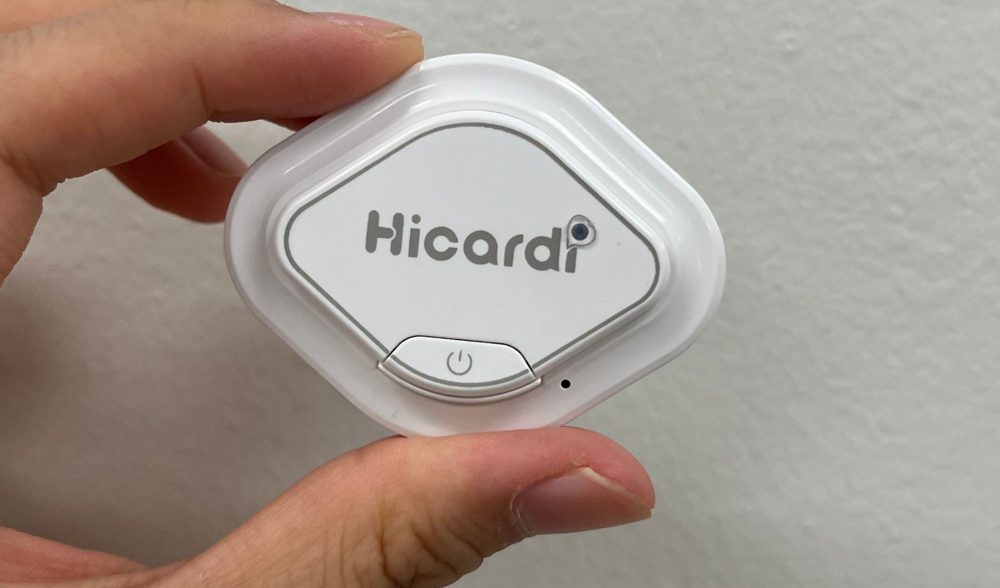
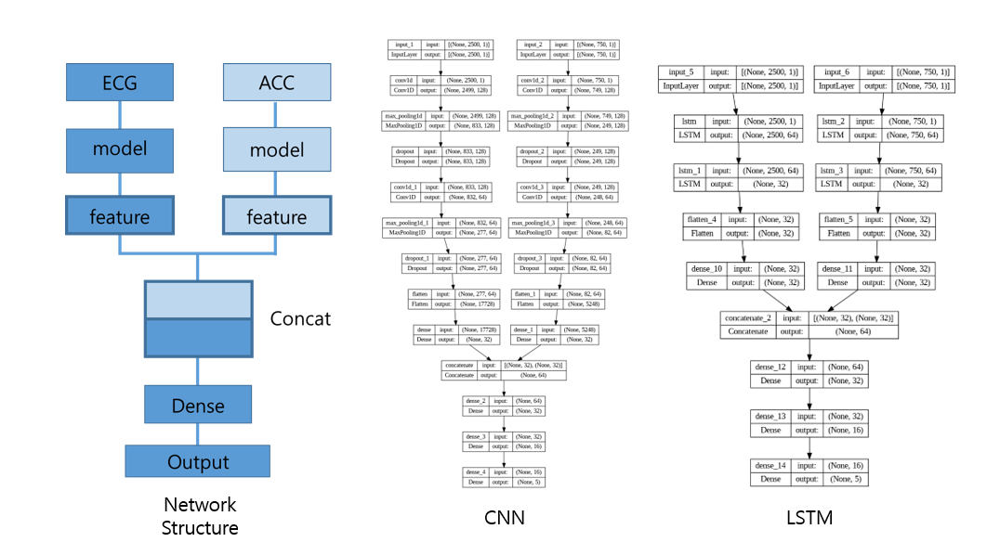
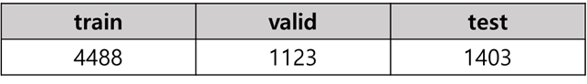
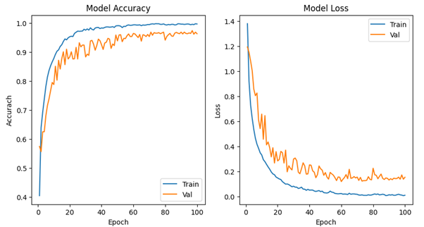
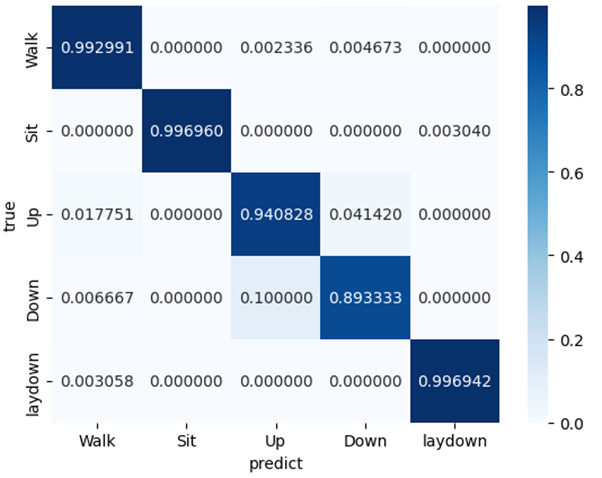
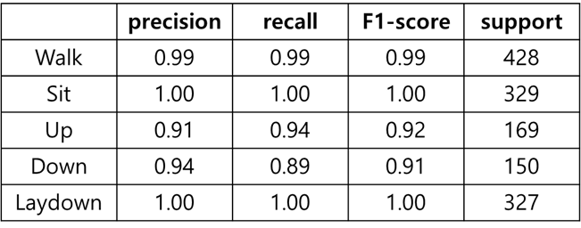

# Motion recognition

**Result**

Achieved 97% accuracy for 5 classes! :smile:

**Data**

Class : Walk, Sit, Lay, Step up, Step down 

Collection period : 2024.05.14 ~ 2024.05.30

Number of Subject : about 10

Ingestion devices : Hicardi

Feature : ECG, Accelerometer(Multi-Modality)

Model Structure Figure

Data Split

Train Report

